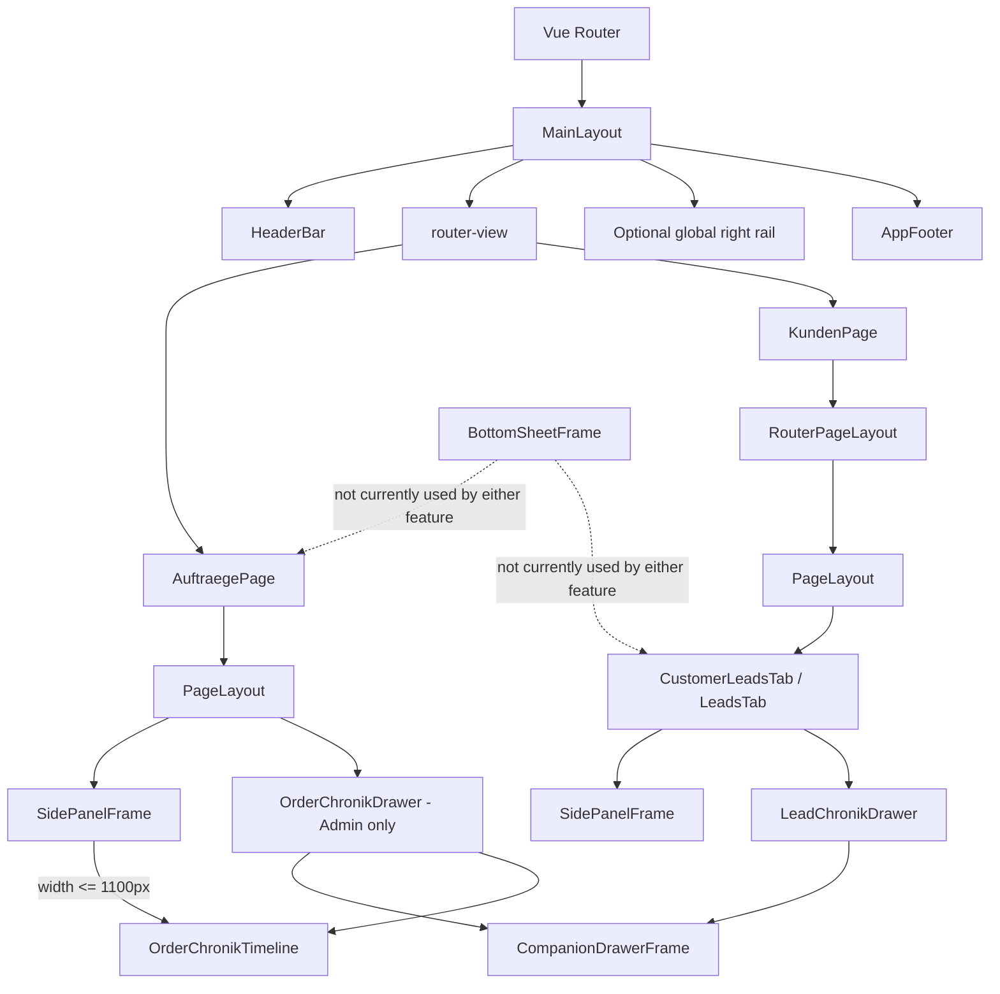
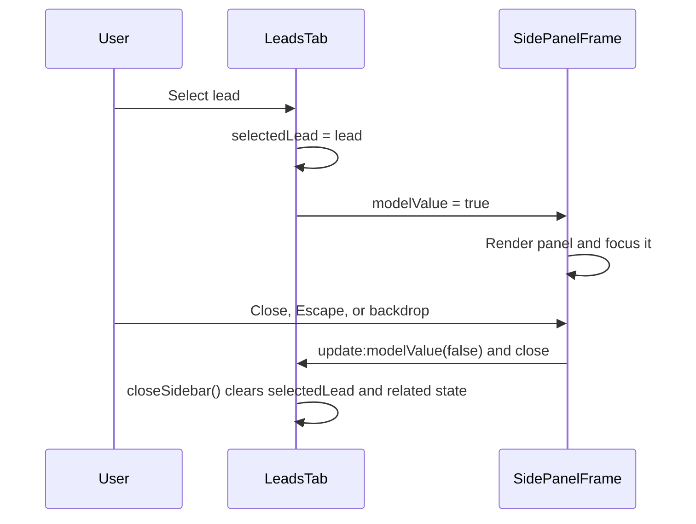

# Frontend layout and detail frames

This document describes how `MainLayout.vue`, `PageLayout.vue`, `SidePanelFrame.vue`, `CompanionDrawerFrame.vue`, and `BottomSheetFrame.vue` relate to `LeadsTab.vue` and `AuftraegePage.vue`.

## Responsibilities

| Component | Responsibility |
| --- | --- |
| `MainLayout.vue` | Application shell for authenticated routes: header, route content, optional global right rail, footer, and global signature modals. |
| `PageLayout.vue` | Reusable page shell inside the router view: optional title/actions, tabs, width constraint, and scrollable or flush content surface. |
| `SidePanelFrame.vue` | Record-detail frame. It can render as an inline right panel or delegate to `ModalFrame` when `presentation="modal"`. |
| `CompanionDrawerFrame.vue` | Reusable desktop drawer that accompanies a side panel. It owns resizing, collapsing, persistence, panel offset, embedding, slots, and transitions. |
| `BottomSheetFrame.vue` | Teleported mobile dialog that slides up from the bottom. It is independent of `SidePanelFrame`. |

## Overall hierarchy

Authenticated routes are children of `MainLayout`. Its `<router-view />` renders either `AuftraegePage` or `KundenPage` in the main content area.



## MainLayout

`MainLayout.vue` is the outer authenticated application shell.

- `.content` contains the active route and provides page padding, background, minimum height, and `overflow: hidden`.
- `HeaderBar` receives a title detected from the rendered route. If a child has an element matching the page-title selectors, `MainLayout` copies its text into the header and hides the original with `layout-managed-page-title`.
- The `.right` rail is a separate global UI area controlled by the `useUi` store. It is not the record-detail panel used by leads and orders.
- `AuftraegePage` and `KundenPage` are direct child routes, so both inherit this same outer shell.

This distinction matters: the global `.right` rail hosts tools such as shortcuts or comments, while `SidePanelFrame` belongs to the feature content and displays a selected lead or order.

## PageLayout

`PageLayout.vue` establishes the inner page structure:

- `width` selects `standard`, `wide`, or `full` maximum width.
- `content-variant="surface"` adds padding, border, background, rounded corners, and vertical scrolling.
- `content-variant="flush"` removes that surface and clips overflow.
- Optional tabs implement accessible tab roles and keyboard navigation.
- The default slot contains the feature UI and its local detail panel.

### AuftraegePage

`AuftraegePage.vue` uses `PageLayout` directly:

```vue
<PageLayout width="full" content-variant="surface">
  <div class="auftraege-page">
    <div class="main-content">...</div>
    <SidePanelFrame v-model="hasSelectedEvent">...</SidePanelFrame>
  </div>
</PageLayout>
```

The `.auftraege-page` flex container makes the calendar and `SidePanelFrame` siblings. The panel therefore consumes horizontal space inside the full-width page instead of using `MainLayout`'s global right rail.

### LeadsTab

`LeadsTab.vue` does not instantiate `PageLayout` itself. The current route hierarchy supplies it:

1. `KundenPage.vue` renders `RouterPageLayout`.
2. `RouterPageLayout.vue` maps the active route to a tab and delegates rendering to `PageLayout`.
3. Its default slot renders `CustomerLeadsTab.vue`.
4. `CustomerLeadsTab.vue` renders `LeadsTab.vue`.

This keeps page tabs and route navigation outside the lead feature while allowing `LeadsTab` to own its toolbar, board, and selected-lead panel.

## SidePanelFrame

`SidePanelFrame` is controlled with `v-model`. Its `modelValue` determines whether the detail UI exists.

### Panel presentation

With the default `presentation="panel"`, it renders a sticky `<aside>` as a flex sibling of the feature's main content. The frame owns:

- panel width and responsive width reduction;
- header, action, body, and close-button slots;
- focus when opened;
- Escape and backdrop closing;
- enter/leave transitions;
- the scrollable panel body.

At widths up to 768 px, the same panel becomes a fixed, full-screen view. This is the current mobile detail behavior for both leads and orders.

### Modal presentation

When `presentation="modal"`, `SidePanelFrame` renders `ModalFrame` instead of the `<aside>`. Only `LeadsTab` currently uses this mode. The action menu changes `leadPanelPresentation` between `panel` and `modal`, allowing the lead details to be detached and returned to the sidebar.

`SidePanelFrame` declares `update:presentation`, which supports `v-model:presentation`. The current component does not change the presentation internally; `LeadsTab` owns and updates that value.

### Leads state flow

`selectedLead` is the source of truth. A computed adapter exposes it as a Boolean model:

```js
const hasSelectedLead = computed({
  get: () => !!selectedLead.value,
  set: (open) => { if (!open) closeSidebar(); },
});
```



The lead panel also coordinates `LeadChronikDrawer`:

- In panel mode, `sidebar-open` lets the drawer account for the occupied sidebar.
- In modal mode, `embedded` is true and the drawer targets `#lead-chronik-modal-host` in the modal footer.
- Opening or closing a lead resets presentation to `panel` and manages body scrolling on narrower screens.

## CompanionDrawerFrame

`CompanionDrawerFrame.vue` is the reusable frame for secondary desktop content that belongs to the selected record in a `SidePanelFrame`. It does not know about leads, activities, or chronology data.

The frame provides:

- default title, icon, count, and context-title rendering;
- `title`, `actions`, default body, and `footer` slots;
- collapse and close controls;
- drag-to-resize with configurable minimum height and top boundary;
- height and collapsed-state persistence through a caller-provided `storageKey`;
- automatic right offset while the associated side panel is open;
- fixed workspace and embedded modal presentations;
- optional desktop-only behavior.

The generic contract uses `modelValue` and emits `update:modelValue`, `update:collapsed`, and `close`. A new feature can use it directly or place a domain wrapper around it.

### LeadChronikDrawer wrapper

`LeadChronikDrawer.vue` is now a thin lead-specific wrapper around `CompanionDrawerFrame`. It configures:

- the `Chronik` title and history icon;
- lead-specific storage keys;
- the lead workspace's left offset and top boundary;
- the selector used to measure the lead `SidePanelFrame`;
- desktop-only display behavior.

Its default and footer slots remain owned by `LeadsTab`, which supplies the timeline and comment composer. `OrderChronikDrawer` follows the same wrapper pattern, with its timeline and note composer in `OrderChronikTimeline`.

```vue
<CompanionDrawerFrame
  v-model="drawerOpen"
  title="Aktivitäten"
  :icon="['fas', 'clock-rotate-left']"
  :side-panel-open="hasSelectedRecord"
  side-panel-selector=".feature-page .sp-panel"
  storage-key="feature_activity_drawer"
>
  <FeatureTimeline />
  <template #footer><FeatureComposer /></template>
</CompanionDrawerFrame>
```

### Orders state flow

`AuftraegePage` follows the same Boolean-adapter pattern with Options API state:

```js
hasSelectedEvent: {
  get() { return Boolean(this.selectedEvent); },
  set(open) { if (!open) this.selectedEvent = null; },
}
```

Selecting an order fills `selectedEvent`, which opens the panel. A close action from `SidePanelFrame` emits `update:modelValue(false)`, and the computed setter clears `selectedEvent`. Orders use only the default panel presentation; they do not expose the detachable modal mode.

Admins can toggle the selected order's Chronik from the panel actions. Above 1100px, `OrderChronikDrawer` configures `CompanionDrawerFrame` with the independent persistence key `orders_chronik_drawer`, the order panel selector, and a 380px default height. At 1100px and below, the same `OrderChronikTimeline` appears inside the detail panel, matching the frame's desktop-only breakpoint. Closing the order or losing Admin access closes the Chronik.

Successful order mutations from the shared Axios client increment the selected order's Chronik revision. This includes mutations inside an open editor and calendar removals. The timeline reloads independently, aborts stale reads, and never makes requests for non-Admins. See [Auftrag-Chronik](AUFTRAG-CHRONIK.md) for capture, authorization, and test coverage.

## BottomSheetFrame

`BottomSheetFrame.vue` is not currently imported or rendered by `LeadsTab.vue` or `AuftraegePage.vue`. It should therefore not be considered part of their active render trees.

It is a separate mobile-oriented primitive with these behaviors:

- teleports its backdrop and sheet to `<body>`;
- slides up from the bottom;
- supports title, subtitle, custom header, and close button;
- closes through `update:modelValue(false)` plus a `close` event;
- supports Escape and backdrop closing;
- focuses the sheet after opening;
- constrains content to `88vh` and accounts for the bottom safe area.

It is currently used elsewhere, for example in `DispoTable.vue`. If leads or orders later adopt it for mobile details, the feature must choose between `SidePanelFrame` and `BottomSheetFrame` at the feature level. `SidePanelFrame` does not automatically switch to `BottomSheetFrame`.

## Practical rules

1. Put authenticated application chrome in `MainLayout`; do not use its global right rail for feature record details.
2. Use `PageLayout` once per page route. Nested tab components such as `LeadsTab` should rely on the parent page shell.
3. Keep the selected domain object (`selectedLead` or `selectedEvent`) as the source of truth and adapt it to the frame's Boolean `v-model`.
4. Use `SidePanelFrame` when details should remain beside the main workspace or detach into a desktop modal.
5. Use `CompanionDrawerFrame` for desktop content that accompanies the selected side-panel record; keep domain data and actions in a thin wrapper or slotted feature component.
6. Give every drawer use case a unique `storageKey` so persisted dimensions do not leak between pages.
7. Use `BottomSheetFrame` only when a partial-height, mobile-first interaction is desired and explicitly wire it into the feature.
8. Keep feature actions and content in the frame's named/default slots; let the frame own focus, closing, transitions, sizing, and scrolling.

## Relevant files

- `frontend/Straight-Monitor/src/layouts/MainLayout.vue`
- `frontend/Straight-Monitor/src/components/layout/PageLayout.vue`
- `frontend/Straight-Monitor/src/components/layout/RouterPageLayout.vue`
- `frontend/Straight-Monitor/src/components/frames/SidePanelFrame.vue`
- `frontend/Straight-Monitor/src/components/frames/CompanionDrawerFrame.vue`
- `frontend/Straight-Monitor/src/components/frames/BottomSheetFrame.vue`
- `frontend/Straight-Monitor/src/components/LeadsTab.vue`
- `frontend/Straight-Monitor/src/components/leads/LeadChronikDrawer.vue`
- `frontend/Straight-Monitor/src/components/orders/OrderChronikDrawer.vue`
- `frontend/Straight-Monitor/src/components/orders/OrderChronikTimeline.vue`
- `frontend/Straight-Monitor/src/components/CustomerLeadsTab.vue`
- `frontend/Straight-Monitor/src/components/KundenPage.vue`
- `frontend/Straight-Monitor/src/components/AuftraegePage.vue`
