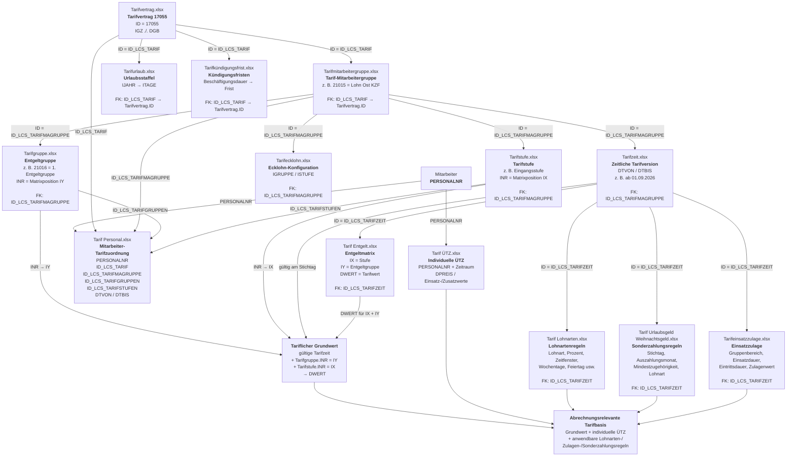
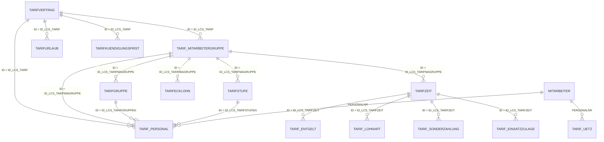

# Zvoove-Tarifdatenmodell – Tarifvertrag 17055

**Scope:** Analyse der bereitgestellten Zvoove-Tarifexporte  
**Relevanter Tarifvertrag:** `17055`  
**Bezeichnung im Export:** `IGZ ./. DGB`

> Dieses Dokument beschreibt ausschließlich das aus den bereitgestellten Tabellen rekonstruierbare Zvoove-Datenmodell.  
> Die zentrale Korrektur gegenüber der ersten Analyse ist: **Der tarifliche Entgeltwert kann aus den vorhandenen Tabellen vollständig aufgelöst werden.**
>
> Mit der zusätzlich gelieferten echten `Tarifgruppe` ist die zuvor rekonstruierte Entgeltgruppen-Zuordnung jetzt auch **direkt relational belegt**.

---

# 1. Kernprinzip

Zvoove speichert den Tarif nicht als einzelnes Feld wie:

```text
Mitarbeiter → Stundenlohn 15,33 €
```

sondern als relationale, zeitabhängige Tarifstruktur.

Für einen Mitarbeiter wird der tarifliche Wert über folgende Kette bestimmt:

```text
Tarif Personal
    │
    ├── Tarifvertrag
    │      ↓
    │    17055
    │
    ├── Tarif-Mitarbeitergruppe
    │      ↓
    │   Tarifmitarbeitergruppe.xlsx
    │
    ├── Entgeltgruppe
    │      ↓
    │   Tarifgruppe.xlsx
    │      ↓
    │   Tarifgruppe.INR = Position IY
    │
    └── Tarifstufe
           ↓
        Tarifstufe.INR = Position IX

Tarif-Mitarbeitergruppe
    │
    ▼
gültige Tarifzeit
    │
    ▼
Tarif Entgelt
    │
    ├── IX = Tarifstufe
    ├── IY = Entgeltgruppe
    └── DWERT = tariflicher Entgeltwert
```

Der relevante Tarifvertrag ist:

```text
ID            17055
CBEZEICHNUNG  IGZ ./. DGB
DARBWOCHE     35
SAENDERUNG    Importiert
```

---

# 2. Die Tabellen und ihre Aufgaben

| Datei | Rolle im Tarifmodell |
|---|---|
| `Tarifvertrag.xlsx` | Oberste Tarifdefinition; relevant ist Tarifvertrag `17055` |
| `Tarifmitarbeitergruppe.xlsx` | Definiert die Tarif-Mitarbeitergruppen / Tarifvarianten innerhalb des Tarifvertrags |
| `Tarifgruppe.xlsx` | Definiert die konkreten Entgeltgruppen innerhalb einer Tarif-Mitarbeitergruppe; `INR` entspricht der Matrixposition `IY` |
| `Tarifstufe.xlsx` | Definiert die Stufen innerhalb einer Tarif-Mitarbeitergruppe; `INR` entspricht der Matrixposition `IX` |
| `Tarifzeit.xlsx` | Definiert zeitlich gültige Tarifversionen |
| `Tarif Entgelt.xlsx` | Enthält die konkrete Entgeltmatrix je Tarifzeit |
| `Tarif Lohnarten.xlsx` | Definiert je Tarifzeit die anwendbaren Lohnarten und deren Berechnungs-/Zeitregeln |
| `Tarif Urlaubsgeld Weihnachtsgeld.xlsx` | Definiert je Tarifzeit Regeln für Urlaubs- und Weihnachtsgeld |
| `Tarifeinsatzzulage.xlsx` | Definiert je Tarifzeit einsatz-/zugehörigkeitsabhängige Zulagen nach Entgeltgruppenbereich |
| `Tarif Personal.xlsx` | Ordnet Mitarbeiter einer Tarif-Mitarbeitergruppe, Entgeltgruppe und Tarifstufe zu |
| `Tarif ÜTZ.xlsx` | Enthält zeitabhängige mitarbeiterbezogene übertarifliche Werte |
| `Tarifecklohn.xlsx` | Enthält zusätzliche Ecklohn-Konfiguration je Tarif-Mitarbeitergruppe |
| `Tarifkündigungsfrist.xlsx` | Enthält die Kündigungsfristen-Staffel direkt für den Tarifvertrag |
| `Tarifurlaub.xlsx` | Enthält die Urlaubsanspruchs-Staffel direkt für den Tarifvertrag |

---


# 2.1 Gesamtübersicht als Diagramm

Das folgende Diagramm zeigt den **fachlichen Zusammenhang aller 14 bisher analysierten Tabellen** und gleichzeitig, über welche Schlüssel sie miteinander verbunden sind.



## So liest man das Diagramm

Die Struktur hat vier Ebenen:

```text
1. Tarifvertragsebene
   Tarifvertrag 17055
   ├── Tarifurlaub
   └── Tarifkündigungsfrist

2. Tarif-Mitarbeitergruppenebene
   Tarifmitarbeitergruppe
   ├── Tarifgruppe (Entgeltgruppen)
   ├── Tarifstufe
   ├── Tarifzeit
   └── Tarifecklohn

3. Tarifzeitebene
   Tarifzeit
   ├── Tarif Entgelt
   ├── Tarif Lohnarten
   ├── Urlaubsgeld / Weihnachtsgeld
   └── Tarifeinsatzzulage

4. Mitarbeiterebene
   Mitarbeiter
   ├── Tarif Personal
   └── Tarif ÜTZ
```

Für die **eigentliche Entgeltauflösung** ist der zentrale Pfad:

```text
Mitarbeiter
    ↓
Tarif Personal
    ├── ID_LCS_TARIFMAGRUPPE → Tarifmitarbeitergruppe
    ├── ID_LCS_TARIFGRUPPEN  → Tarifgruppe.INR → IY
    └── ID_LCS_TARIFSTUFEN   → Tarifstufe.INR → IX
              ↓
      gültige Tarifzeit
              ↓
         Tarif Entgelt
    ↓
DWERT
```

Die übrigen Tabellen ergänzen diesen Grundwert um weitere tarifliche Regeln oder beschreiben andere tarifliche Ansprüche.

---

# 3. ER-Struktur



## Wichtig zur Benennung

Mit der nun zusätzlich gelieferten echten `Tarifgruppe` ist die Benennung eindeutig:

### `Tarifmitarbeitergruppe.xlsx`

Diese Tabelle enthält die übergeordneten Tarifvarianten und wird über:

```text
ID_LCS_TARIFMAGRUPPE
```

referenziert.

Beispiele:

```text
21015  Lohn Ost KZF
21195  Lohn Ost Festangestellt (Gastro)
22436  KZF Pauschal
23437  Lohn Ost KZF 603 u. geringf. ohne AZK
27356  Lohn Ost KZF 603 u. geringf. mit AZK
```

### `Tarifgruppe.xlsx`

Diese Tabelle enthält die **konkreten Entgeltgruppen innerhalb einer Tarif-Mitarbeitergruppe**.

Beispiel für Tarif-Mitarbeitergruppe `21015`:

```text
ID      INR   CBEZEICHNUNG
21016    1    1. Entgeltgruppe
21017    2    2. Entgeltgruppe a
24932    3    2. Entgeltgruppe b
21018    4    3. Entgeltgruppe
21019    5    4. Entgeltgruppe
...
21024   10    9. Entgeltgruppe
```

Der entscheidende Zusammenhang ist jetzt **direkt belegt**:

```text
Tarif Personal.ID_LCS_TARIFGRUPPEN
        ↓
Tarifgruppe.ID
        ↓
Tarifgruppe.INR
        ↓
Tarif Entgelt.IY
```

Damit muss die Matrixposition `IY` nicht mehr aus IDs oder Historie rekonstruiert werden.

---

# 4. Tarifvertrag 17055

Aus `Tarifvertrag.xlsx`:

```text
ID                         17055
CBEZEICHNUNG               IGZ ./. DGB
SAENDERUNG                 Importiert
DARBWOCHE                  35
ILOHNUNTERGRENZE           1
BRANCHE_VERRECHART         3
TARIFVERBAND               1
URLAUBBERECHNUNGNACHBURLG  1
```

Der Tarifvertrag ist die oberste Ebene.

Alle für Straightforward relevanten Tarif-Mitarbeitergruppen verweisen über:

```text
Tarifmitarbeitergruppe.ID_LCS_TARIF = 17055
```

auf diesen Tarifvertrag.

---

# 5. Tarif-Mitarbeitergruppen aus Tarifmitarbeitergruppe.xlsx

Für Tarifvertrag `17055` enthält der Export:

| ID | CGRUPPE | CBEZEICHNUNG |
|---:|---|---|
| `17089` | Lohn Ost Allgemein | Inaktiv |
| `21015` | Lohn Ost KZF | – |
| `21195` | Lohn Ost Festangestellt (Gastro) | – |
| `22436` | KZF Pauschal | – |
| `23437` | Lohn Ost KZF 603 u. geringf. ohne AZK | – |
| `27356` | Lohn Ost KZF 603 u. geringf. mit AZK | – |
| `27733` | Lohn Ost KZF AZK | Inaktiv |
| `28105` | Lohn Ost NICHT BENUTZEN Geringfügig AZK | Nicht benutzen |

Damit hat ein Mitarbeiter nicht nur:

```text
Tarifvertrag = 17055
```

sondern zusätzlich eine Variante wie:

```text
Tarif-Mitarbeitergruppe = 21015
"Lohn Ost KZF"
```

---

# 6. Tarifstufe → IX der Entgeltmatrix

`Tarifstufe.xlsx` hängt direkt an der Tarif-Mitarbeitergruppe.

Beispiel:

```text
ID                         21025
ID_LCS_TARIFMAGRUPPE       21015
INR                        1
CBEZEICHNUNG               Eingangsstufe
```

Für die relevanten 17055-Gruppen existiert im Export jeweils eine:

```text
INR = 1
"Eingangsstufe"
```

Die Entgeltmatrix in `Tarif Entgelt.xlsx` verwendet:

```text
IX = 1
```

für diese Stufe.

Damit ist die Relation:

```text
Tarif Personal.ID_LCS_TARIFSTUFEN
        ↓
Tarifstufe.ID
        ↓
Tarifstufe.INR
        ↓
Tarif Entgelt.IX
```

Beispiel:

```text
ID_LCS_TARIFSTUFEN = 21025
→ Tarifstufe.INR = 1
→ IX = 1
```

---

# 7. Tarifgruppe → IY der Entgeltmatrix

Mit `Tarifgruppe.xlsx` ist der bislang nur rekonstruierte Baustein jetzt direkt vorhanden.

Die Tabelle enthält unter anderem:

```text
ID
ID_LCS_TARIFMAGRUPPE
INR
CBEZEICHNUNG
ILEISTGRUPPE
INR_OLD
INSERT_BY_DUPLICATE
```

Die Relation lautet:

```text
Tarif Personal.ID_LCS_TARIFGRUPPEN
        ↓
Tarifgruppe.ID
        ↓
Tarifgruppe.ID_LCS_TARIFMAGRUPPE
        ↓
zugehörige Tarif-Mitarbeitergruppe
```

und für die Entgeltmatrix:

```text
Tarifgruppe.INR
        ↓
Tarif Entgelt.IY
```

## Beispiel: Tarif-Mitarbeitergruppe 21015 – Lohn Ost KZF

Die echte Tarifgruppen-Tabelle enthält:

| Tarifgruppe.ID | Tarifgruppe.INR | Bezeichnung | `INR_OLD` | `INSERT_BY_DUPLICATE` |
|---:|---:|---|---:|---:|
| `21016` | 1 | 1. Entgeltgruppe | – | – |
| `21017` | 2 | 2. Entgeltgruppe a | – | – |
| `24932` | 3 | 2. Entgeltgruppe b | – | 1 |
| `21018` | 4 | 3. Entgeltgruppe | 3 | – |
| `21019` | 5 | 4. Entgeltgruppe | 4 | – |
| `21020` | 6 | 5. Entgeltgruppe | 5 | – |
| `21021` | 7 | 6. Entgeltgruppe | 6 | – |
| `21022` | 8 | 7. Entgeltgruppe | 7 | – |
| `21023` | 9 | 8. Entgeltgruppe | 8 | – |
| `21024` | 10 | 9. Entgeltgruppe | 9 | – |

Damit ist die fachliche Zuordnung vollständig:

```text
21016 → INR 1  → IY 1  → EG 1
21017 → INR 2  → IY 2  → EG 2a
24932 → INR 3  → IY 3  → EG 2b
21018 → INR 4  → IY 4  → EG 3
21019 → INR 5  → IY 5  → EG 4
21020 → INR 6  → IY 6  → EG 5
21021 → INR 7  → IY 7  → EG 6
21022 → INR 8  → IY 8  → EG 7
21023 → INR 9  → IY 9  → EG 8
21024 → INR 10 → IY 10 → EG 9
```

Es ist also **keine ID-Arithmetik oder indirekte Rekonstruktion mehr nötig**.

## Historische Einfügung von EG 2b

Die Tabelle bestätigt außerdem direkt die historische Erweiterung:

```text
24932
INR = 3
CBEZEICHNUNG = 2. Entgeltgruppe b
INSERT_BY_DUPLICATE = 1
```

Die vorherigen Gruppen ab der alten Position 3 tragen:

```text
INR_OLD = 3, 4, 5, ...
```

und wurden auf:

```text
INR = 4, 5, 6, ...
```

verschoben.

Das entspricht exakt den Feldern `IY_OLD` und `INSERT_BY_DUPLICATE` in `Tarif Entgelt.xlsx`.

## Aktuelle Entgeltmatrix ab 01.09.2026

Für die Tarifzeit `1108622` der Tarif-Mitarbeitergruppe `21015` gilt:

| Tarifgruppe | INR / IY | DWERT |
|---|---:|---:|
| EG 1 | 1 | 15,33 € |
| EG 2a | 2 | 15,67 € |
| EG 2b | 3 | 16,08 € |
| EG 3 | 4 | 17,11 € |
| EG 4 | 5 | 18,09 € |
| EG 5 | 6 | 20,27 € |
| EG 6 | 7 | 22,52 € |
| EG 7 | 8 | 26,20 € |
| EG 8 | 9 | 28,04 € |
| EG 9 | 10 | 29,42 € |

Die Matrixauflösung ist damit direkt relational:

```text
Tarifgruppe.INR = Tarif Entgelt.IY
```

---

# 8. Auflösung für die übrigen Tarif-Mitarbeitergruppen

Dasselbe direkte `Tarifgruppe.INR → Tarif Entgelt.IY`-Schema gilt für die anderen Tarif-Mitarbeitergruppen.

## 21195 – Lohn Ost Festangestellt (Gastro)

Ursprüngliche Gruppen:

```text
21196 ... 21204
```

zusätzliche eingeschobene Gruppe:

```text
24941
```

Mapping:

| Gruppen-ID | IY |
|---:|---:|
| 21196 | 1 |
| 21197 | 2 |
| 24941 | 3 |
| 21198 | 4 |
| 21199 | 5 |
| 21200 | 6 |
| 21201 | 7 |
| 21202 | 8 |
| 21203 | 9 |
| 21204 | 10 |

Tarifstufe:

```text
21205 → INR 1 → IX 1
```

---

## 22436 – KZF Pauschal

Mapping:

| Gruppen-ID | IY |
|---:|---:|
| 22437 | 1 |
| 22438 | 2 |
| 24951 | 3 |
| 22439 | 4 |
| 22440 | 5 |
| 22441 | 6 |
| 22442 | 7 |
| 22443 | 8 |
| 22444 | 9 |
| 22445 | 10 |

Tarifstufe:

```text
22446 → INR 1 → IX 1
```

---

## 23437 – Lohn Ost KZF 603 u. geringf. ohne AZK

Mapping:

| Gruppen-ID | IY |
|---:|---:|
| 23438 | 1 |
| 23439 | 2 |
| 24960 | 3 |
| 23440 | 4 |
| 23441 | 5 |
| 23442 | 6 |
| 23443 | 7 |
| 23444 | 8 |
| 23445 | 9 |
| 23446 | 10 |

Tarifstufe:

```text
23447 → INR 1 → IX 1
```

---

## Neuere Tarif-Mitarbeitergruppen

Bei später angelegten Gruppen ist die 10er-Struktur bereits direkt vorhanden.

### 27356 – mit AZK

```text
27357 → IY 1
27358 → IY 2
27359 → IY 3
27360 → IY 4
27361 → IY 5
27362 → IY 6
27363 → IY 7
27364 → IY 8
27365 → IY 9
27366 → IY 10

27367 → Tarifstufe / IX 1
27368 → Ecklohn
```

### 27733 – KZF AZK

```text
27734 → IY 1
27735 → IY 2
27736 → IY 3
27737 → IY 4
27738 → IY 5
27739 → IY 6
27740 → IY 7
27741 → IY 8
27742 → IY 9
27743 → IY 10

27744 → Tarifstufe / IX 1
27745 → Ecklohn
```

### 28105 – NICHT BENUTZEN Geringfügig AZK

```text
28106 → IY 1
28107 → IY 2
28108 → IY 3
28109 → IY 4
28110 → IY 5
28111 → IY 6
28112 → IY 7
28113 → IY 8
28114 → IY 9
28115 → IY 10

28116 → Tarifstufe / IX 1
28117 → Ecklohn
```

---

# 9. Tarifzeit – zeitliche Versionierung

`Tarifzeit.xlsx` verbindet die Tarif-Mitarbeitergruppe mit einem Gültigkeitszeitraum.

Beispiel Gruppe `21015`:

| Tarifzeit-ID | Von | Bis |
|---:|---|---|
| `1104775` | 01.03.2025 | 31.12.2025 |
| `1107092` | 01.01.2026 | 31.08.2026 |
| `1108622` | 01.09.2026 | offen |

Für eine Abrechnung wird also die Tarifzeit gewählt, für die gilt:

```text
DTVON <= Abrechnungsdatum

UND

DTBIS >= Abrechnungsdatum
ODER DTBIS IS NULL
```

---

# 10. Tarif Entgelt – der eigentliche tarifliche Wert

`Tarif Entgelt.xlsx` enthält die Matrix:

```text
ID_LCS_TARIFZEIT
IX
IY
DWERT
```

Die vollständige Schlüsselkombination lautet konzeptionell:

```text
Tarifzeit
+ IX / Tarifstufe
+ IY / Entgeltgruppe
= DWERT
```

Für Tarifzeit:

```text
1108622
Gruppe 21015
gültig ab 01.09.2026
```

gilt:

| IX | IY | DWERT |
|---:|---:|---:|
| 1 | 1 | 15,33 |
| 1 | 2 | 15,67 |
| 1 | 3 | 16,08 |
| 1 | 4 | 17,11 |
| 1 | 5 | 18,09 |
| 1 | 6 | 20,27 |
| 1 | 7 | 22,52 |
| 1 | 8 | 26,20 |
| 1 | 9 | 28,04 |
| 1 | 10 | 29,42 |

---

# 11. Vollständiges Beispiel – Mitarbeiter 1000001

Aus `Tarif Personal.xlsx`:

```text
IPERSONALNR              1000001
ID_LCS_TARIF             17055
ID_LCS_TARIFMAGRUPPE     21015
ID_LCS_TARIFGRUPPEN      21016
ID_LCS_TARIFSTUFEN       21025
DTVON                     12.11.2017
DTBIS                     offen
```

## Schritt 1 – Tarifvertrag

```text
17055
→ IGZ ./. DGB
```

## Schritt 2 – Tarif-Mitarbeitergruppe

```text
21015
→ Lohn Ost KZF
```

## Schritt 3 – Entgeltgruppe

```text
Tarif Personal.ID_LCS_TARIFGRUPPEN = 21016
→ Tarifgruppe.ID = 21016
→ Tarifgruppe.CBEZEICHNUNG = "1. Entgeltgruppe"
→ Tarifgruppe.INR = 1
→ IY = 1
```

## Schritt 4 – Tarifstufe

```text
21025
→ INR 1
→ IX 1
```

## Schritt 5 – gültige Tarifzeit am 30.09.2026

```text
21015
→ Tarifzeit 1108622
→ gültig ab 01.09.2026
```

## Schritt 6 – Entgeltmatrix

Gesucht:

```text
ID_LCS_TARIFZEIT = 1108622
IX                = 1
IY                = 1
```

Treffer:

```text
DWERT = 15,33
```

Damit ergibt sich für diese Tarifzuordnung am 30.09.2026:

```text
Tariflicher Wert = 15,33 €
```

---

# 12. Beispiel mit der eingeschobenen Gruppe

Angenommen ein Mitarbeiter hat:

```text
ID_LCS_TARIFMAGRUPPE = 21015
ID_LCS_TARIFGRUPPEN  = 24932
ID_LCS_TARIFSTUFEN   = 21025
```

Dann:

```text
24932 → IY 3
21025 → IX 1
```

Für Tarifzeit `1108622`:

```text
IX 1
IY 3
→ DWERT 16,08 €
```

Damit ist auch die später eingefügte Entgeltgruppe korrekt auflösbar.

---

# 13. Bedeutung von IY_OLD und INSERT_BY_DUPLICATE

Diese beiden Felder erklären die historische Erweiterung der Tarifmatrix.

In älteren Tarifzeiten findet sich:

```text
IY 2 → normaler bestehender Wert

IY 3
INSERT_BY_DUPLICATE = 1
→ neu eingefügte / duplizierte Position

IY 4
IY_OLD = 3

IY 5
IY_OLD = 4

...
```

Das bedeutet konzeptionell:

```text
vorher:

1
2
3
4
5
6
7
8
9

nach Erweiterung:

1
2
NEU
3
4
5
6
7
8
9
```

Daher verschieben sich die bisherigen Gruppen:

```text
alt 3 → neu 4
alt 4 → neu 5
...
alt 9 → neu 10
```

Damit lässt sich die heutige 10er-Matrix auch historisch sauber erklären.

---

# 14. Tarif Personal

`Tarif Personal.xlsx` ist die zentrale Mitarbeiterzuordnung.

Sie enthält insbesondere:

```text
IPERSONALNR
ID_LCS_TARIF
ID_LCS_TARIFMAGRUPPE
ID_LCS_TARIFGRUPPEN
ID_LCS_TARIFSTUFEN
DTVON
DTBIS
```

Damit beantwortet die Tabelle:

> Welcher Tarif, welche Tarifvariante, welche Entgeltgruppe und welche Stufe galt für den Mitarbeiter in welchem Zeitraum?

Das ist wesentlich besser als ein einzelnes aktuelles `hourlyRate`-Feld, weil historische Änderungen erhalten bleiben.

---

# 15. Tarif ÜTZ

`Tarif ÜTZ.xlsx` arbeitet mitarbeiterbezogen und zeitabhängig.

Wichtige Felder:

```text
IPERSONALNR
DTVON
DTBIS
DPREIS
DPREISPROD
DEINSATZZULAGE
DPREISGEHALT
```

Beispiel:

```text
IPERSONALNR = 1001507
DTVON       = 01.04.2022
DTBIS       = offen
DPREIS      = 2,40
```

Damit existiert neben dem tariflichen Matrixwert eine zusätzliche mitarbeiterbezogene Entgeltkomponente.

`Tarif Personal` enthält außerdem:

```text
IUETZNICHTANPASSEN
```

was eine direkte fachliche Verbindung zur ÜTZ-Logik zeigt.

Die genaue mathematische Wirkung der verschiedenen ÜTZ-Felder sollte anhand realer Abrechnungsfälle geprüft werden; die Zuordnung zum Mitarbeiter und Zeitraum ist jedoch eindeutig.

---

# 16. Tarifecklohn

`Tarifecklohn.xlsx` verweist wiederum auf die Tarif-Mitarbeitergruppe:

```text
ID_LCS_TARIFMAGRUPPE
IGRUPPE
ISTUFE
IOPTHOECHERWERT
```

Für die meisten relevanten Gruppen:

```text
IGRUPPE = 6
ISTUFE  = 2
```

Beispiel:

```text
ID                    21026
ID_LCS_TARIFMAGRUPPE  21015
IGRUPPE                6
ISTUFE                 2
```

Dies ist eine zusätzliche tarifliche Referenz-/Ecklohnkonfiguration.

Die konkrete Verwendung dieser Werte innerhalb der Zvoove-Berechnungslogik ist aus den gelieferten Tabellen allein nicht vollständig erklärt und sollte separat verifiziert werden.

---


# 17. Tarif Lohnarten – tarifzeitabhängige Lohnartenregeln

Datei: **`Tarif Lohnarten.xlsx`**

Diese Tabelle hängt **nicht direkt am Tarifvertrag**, sondern an einer konkreten `Tarifzeit`:

```text
Tarifvertrag 17055
    ↓
Tarif-Mitarbeitergruppe
    ↓
Tarifzeit.ID
    ↓
Tarif Lohnarten.ID_LCS_TARIFZEIT
```

Damit sind die Lohnartenregeln genauso historisiert wie die Entgeltwerte. Eine Tarifänderung kann also nicht nur neue Entgeltwerte, sondern auch eine andere Lohnartenkonfiguration mitbringen.

## Zentrale Felder

| Feld | Bedeutung im Datenmodell |
|---|---|
| `ID_LCS_TARIFZEIT` | Tarifperiode, für die die Regel gilt |
| `ILOHNARTNR` | referenzierte Lohnartnummer |
| `IGRUPPE` | interne Regel-/Gruppenzuordnung |
| `DAB`, `DBIS` | Von-/Bis-Grenzen der Regel; je nach Regel offenbar Zeit-/Sonderwerte |
| `IKZSTDUHR` | Kennzeichen für stunden-/uhrzeitbezogene Behandlung |
| `IKZBEZUG` | Bezugsart |
| `CMO` … `CSO` | Wochentagskennzeichen Montag bis Sonntag |
| `CFE` | Feiertagskennzeichen |
| `IPREISNR` | Referenz auf die verwendete Preis-/Berechnungsbasis |
| `DPROZENT` | Prozentsatz |
| `DFESTBETRAG` | möglicher Festbetrag |
| `ID_LCS_TARIFGRUPPEN` | optionale Einschränkung auf eine Entgeltgruppe |
| `ID_LCS_TARIFSTUFEN` | optionale Einschränkung auf eine Tarifstufe |
| `IYGRUPPE`, `IXSTUFE` | Matrixbezug auf Gruppe/Stufe |
| `IKZFEIERTAG` | Feiertagssteuerung |
| `IKZFEHLZEIT` | Fehlzeitensteuerung |
| `DMINSTD`, `DMAXSTD` | Mindest-/Maximalstundenparameter |
| `BERECHNUNGSART` | interne Berechnungsart |
| `IARBEITSZULAGE` | interne Steuerung einer Arbeitszulage |
| `ADDAUSGLEICHSZUL` | Steuerflag zur Ausgleichszulage |
| `ADDBRANCHENZUSCHL` | Steuerflag zur Branchenzuschlagsbehandlung |
| `ADDSONDERZUL` | Steuerflag zur Sonderzulage |

Die Tabelle ist damit **keine einfache Liste von Lohnarten**, sondern eine regelbasierte Konfiguration, wann und wie eine Lohnart innerhalb einer Tarifperiode verwendet wird.

## Aktuelle offene Tarifperioden ab 01.09.2026

Für die derzeit offenen Tarifzeiten des Tarifs `17055` ergeben sich folgende Lohnartnummern:

| Tarif-Mitarbeitergruppe | Tarifzeit | Lohnartnummern im Export |
|---|---:|---|
| `17089` Lohn Ost Allgemein – Inaktiv | `1108589` | `195, 100, 146, 166, 166, 192, 194, 156, 111, 110, 115, 116` |
| `21015` Lohn Ost KZF | `1108622` | `100, 111, 110, 115, 116` |
| `21195` Lohn Ost Festangestellt (Gastro) | `1108736` | `100, 192, 194, 111, 110, 115, 116, 195` |
| `22436` KZF Pauschal | `1108813` | `101, 111, 110, 115, 116` |
| `23437` KZF 603 / geringfügig ohne AZK | `1108840` | `100, 111, 110, 115, 116` |
| `27356` KZF 603 / geringfügig mit AZK | `1108877` | `195, 100, 192, 194, 111, 110, 115, 116` |

Die Gruppen `27733` und `28105` besitzen im Export keine offene Tarifzeit zum Stand der bereitgestellten Daten; sie sind außerdem als `Inaktiv` beziehungsweise `Nicht benutzen` bezeichnet.

### Beispiel einer prozentualen Regel

In der Tarifzeit `1108589` existieren unter anderem:

```text
Lohnart 146
DPROZENT = 50

Lohnart 166
DPROZENT = 25
DAB/DBIS = 23–24 und 0–6

Lohnart 156
DPROZENT = 100
```

Die Tabelle zeigt damit eindeutig, dass Zvoove hier auch **prozentuale und zeitabhängige Lohnartenregeln** speichert.

Die fachlichen Namen hinter den Nummern `100`, `110`, `111`, `146`, `156`, `166`, `192`, `194`, `195` usw. sind in den vorliegenden Dateien jedoch nicht enthalten. Dafür wird zusätzlich der **Lohnarten-Stamm** aus Zvoove benötigt. Die Nummer sollte deshalb bei der Migration nicht eigenmächtig interpretiert werden.

---

# 18. Tarif Urlaubsgeld / Weihnachtsgeld

Datei: **`Tarif Urlaubsgeld Weihnachtsgeld.xlsx`**

Auch diese Tabelle hängt an der `Tarifzeit`:

```text
Tarifzeit.ID
    ↓
Tarif Urlaubsgeld Weihnachtsgeld.ID_LCS_TARIFZEIT
```

Dadurch können die Regeln für Sonderzahlungen mit einer Tarifperiode versioniert werden.

Für alle derzeit offenen relevanten Tarifzeiten ist dieselbe Grundkonfiguration vorhanden:

## Urlaubsgeld

```text
CBEZEICHNUNG                Urlaubsgeld
CSTICHTAG1                  30.06.
IAUSZAHLMONAT               6
ILOHNARTNR                  318
MINMITGLIEDSCHAFTMONATE     12
BANKARBEITSTAGEPRUEFEN      1
IAUSTRITTNOTRELEVANT        0
KURZDURCHFEHLZ              0
```

## Weihnachtsgeld

```text
CBEZEICHNUNG                Weihnachtsgeld
CSTICHTAG1                  30.11.
IAUSZAHLMONAT               11
ILOHNARTNR                  370
MINMITGLIEDSCHAFTMONATE     12
BANKARBEITSTAGEPRUEFEN      1
IAUSTRITTNOTRELEVANT        0
KURZDURCHFEHLZ              0
```

Damit legt diese Tabelle unter anderem fest:

```text
Sonderzahlung
+ Stichtag
+ Auszahlungsmonat
+ zu verwendende Lohnart
+ Mindestmitgliedschaft
+ weitere Steuerflags
```

**Nicht** in dieser Tabelle enthalten ist der konkrete Eurobetrag der Sonderzahlung. Die Datei beschreibt die Anwendungs-/Auszahlungsregel und verweist dafür auf eine Lohnart.

Die Bedeutung einzelner interner Schalter wie `KUENBER` lässt sich aus dem Exportnamen allein nicht zuverlässig weiter auflösen und sollte als Legacy-Konfiguration erhalten bleiben, bis die entsprechende Zvoove-Logik oder Dokumentation geprüft wurde.

---

# 19. Tarifeinsatzzulage

Datei: **`Tarifeinsatzzulage.xlsx`**

Die Einsatzzulage ist ebenfalls an eine konkrete Tarifzeit gebunden:

```text
Tarifzeit.ID
    ↓
Tarifeinsatzzulage.ID_LCS_TARIFZEIT
```

Sie ist deshalb Teil der **zeitabhängigen Entgeltlogik**, nicht lediglich ein Mitarbeiterstammdatum.

## Aktuelle Konfiguration ab 01.09.2026

Für jede der sechs offenen Tarifzeiten des Tarifs `17055` existieren zwei Regeln:

| Matrixgruppe | `IABMONATEEINSATZ` | `IABMONATEEINTRITT` | Stufe | `DZULAGE` |
|---|---:|---:|---:|---:|
| `IGRUPPEAB 1` bis `IGRUPPEBIS 5` | 9 | 14 | 1 bis 1 | `0,20` |
| `IGRUPPEAB 6` bis `IGRUPPEBIS 10` | 9 | 14 | 1 bis 1 | `0,35` |

Mit dem bereits rekonstruierten `IY`-Mapping entspricht dies:

```text
Gruppenposition 1–5
→ EG 1, EG 2a, EG 2b, EG 3, EG 4

Gruppenposition 6–10
→ EG 5 bis EG 9
```

Die Tabelle speichert also zwei unterschiedliche Zulagenwerte abhängig vom Entgeltgruppenbereich.

Zusätzlich trägt jede Regel zwei zeitliche Schwellen:

```text
IABMONATEEINSATZ = 9
IABMONATEEINTRITT = 14
```

Die Feldnamen zeigen, dass Zvoove dabei sowohl die **Einsatzdauer** als auch die Zeit seit **Eintritt** berücksichtigt. Aus dem Tabellenexport allein ist jedoch nicht eindeutig ersichtlich, wie beide Schwellen logisch miteinander verknüpft werden. Diese konkrete Auswertungslogik sollte deshalb mit einem realen Abrechnungsfall oder der Zvoove-Dokumentation validiert werden.

## Verbindung zur historischen Entgeltgruppen-Erweiterung

Ältere Datensätze enthalten zusätzlich:

```text
IGRUPPEAB_OLD
IGRUPPEBIS_OLD
```

Beispielsweise wurde vor der Erweiterung der Entgeltmatrix unterschieden zwischen:

```text
alte Gruppen 1–4
alte Gruppen 5–9
```

und nach der eingefügten zusätzlichen Gruppe:

```text
neue Gruppen 1–5
neue Gruppen 6–10
```

Das passt direkt zur bereits in `Tarif Entgelt` sichtbaren Einfügung einer zusätzlichen Matrixposition an `IY = 3`.

Die Einsatzzulage ist damit ein weiteres Beispiel dafür, dass die **Matrixpositionen der Entgeltgruppen** für die Tarifberechnung relevant sind und bei der Migration explizit erhalten bleiben müssen.

> `DZULAGE` enthält im Export die Werte `0,20` beziehungsweise `0,35`. Die konkrete Einheit wird in der Datei selbst nicht separat bezeichnet; sie sollte bei der fachlichen Validierung nicht ohne Prüfung angenommen werden.

---

# 20. Tarifkündigungsfrist

Datei: **`Tarifkündigungsfrist.xlsx`**

Im Gegensatz zu Lohnarten, Sonderzahlungen und Einsatzzulage hängt diese Tabelle **direkt am Tarifvertrag**:

```text
Tarifvertrag.ID
    ↓
Tarifkündigungsfrist.ID_LCS_TARIF
```

Für Tarifvertrag `17055` existieren **11 Regelzeilen**.

Die Struktur jeder Zeile besteht im Kern aus zwei Wertepaaren:

```text
IANZAHLANG + ITYPANG
        ↓
Schwelle / Dauer der Beschäftigung

IANZAHLKUEND + ITYPKUEND
        ↓
zugehörige Kündigungsfrist
```

Die 11 Datensätze für `17055` lauten:

| `IANZAHLANG` | `ITYPANG` | `IANZAHLKUEND` | `ITYPKUEND` |
|---:|---:|---:|---:|
| 20 | 3 | 7 | 2 |
| 15 | 3 | 6 | 2 |
| 12 | 3 | 5 | 2 |
| 10 | 3 | 4 | 2 |
| 8 | 3 | 3 | 2 |
| 5 | 3 | 2 | 2 |
| 2 | 3 | 1 | 2 |
| 6 | 2 | 4 | 1 |
| 2 | 2 | 2 | 5 |
| 4 | 1 | 1 | 5 |
| 0 | 1 | 2 | 3 |

Damit ist erkennbar, dass Zvoove eine **gestaffelte Kündigungsfristenlogik** direkt als Tarifregel speichert.

Die Enum-Bedeutung der Felder:

```text
ITYPANG
ITYPKUEND
```

ist in den vorliegenden Dateien nicht enthalten. Deshalb wäre es nicht sauber, die Codes `1`, `2`, `3`, `5` ohne weitere Quelle pauschal als Tage/Wochen/Monate oder bestimmte Kündigungstermine zu bezeichnen.

Für eine vollständige Nachbildung benötigt StraightMonitor beziehungsweise eine HR-Komponente entweder:

1. die Enum-Dokumentation aus Zvoove,
2. die zugehörige Anwendungscode-/Metadatentabelle oder
3. eine Validierung der einzelnen Kombinationen gegen die in Zvoove angezeigten Kündigungsfristen.

Diese Tabelle ist primär für **Vertrags-/HR-Logik** relevant und nicht für die laufende Stundenentgeltberechnung.

---

# 21. Tarifurlaub

Datei: **`Tarifurlaub.xlsx`**

Auch der Tarifurlaub hängt direkt am Tarifvertrag:

```text
Tarifvertrag.ID
    ↓
Tarifurlaub.ID_LCS_TARIF
```

Für Tarif `17055` enthält die Tabelle zwei unterschiedliche Regelstände.

## Historischer Stand – gültig bis einschließlich 2020

| `IJAHR` | `ITAGE` | `GUELTIGBISJAHR` |
|---:|---:|---:|
| 0 | 24 | 2020 |
| 1 | 25 | 2020 |
| 2 | 26 | 2020 |
| 3 | 28 | 2020 |
| 4 | 30 | 2020 |

## Neuerer / offener Stand

| `IJAHR` | `ITAGE` | `GUELTIGBISJAHR` |
|---:|---:|---|
| 0 | 25 | offen |
| 1 | 27 | offen |
| 3 | 30 | offen |

Die Struktur ist konsistent mit einer **Staffeltabelle**:

```text
IJAHR
→ Schwelle innerhalb der Beschäftigungs-/Tarifzugehörigkeit

ITAGE
→ dazugehöriger Urlaubsanspruch
```

Beim neueren Regelstand gibt es beispielsweise keinen eigenen Datensatz für `IJAHR = 2`. Das spricht dafür, dass ein erreichter Staffelwert so lange fortgilt, bis die nächste Schwelle erreicht wird, anstatt dass zwingend für jedes einzelne Jahr eine Zeile existieren muss.

Damit wäre die Staffel technisch:

```text
ab Schwelle 0 → 25 Tage
ab Schwelle 1 → 27 Tage
ab Schwelle 3 → 30 Tage
```

Die genaue Definition, **wann Zvoove `IJAHR` hochzählt** und ob dabei Eintrittsjahr, Betriebszugehörigkeitsjahr oder eine andere tarifliche Zählweise verwendet wird, ist im Export nicht separat erläutert. Diese Zähllogik sollte deshalb für eine eigene Berechnung noch fachlich bestätigt werden.

Für StraightMonitor ist die Tabelle relevant für:

```text
Mitarbeiter
    ↓
Eintritt / Zugehörigkeitsdauer
    ↓
Tarifvertrag 17055
    ↓
Tarifurlaub-Staffel
    ↓
Urlaubsanspruch
```

---

# 21.1 Erweiterte Gesamtstruktur mit allen 13 Tabellen

Mit den fünf zusätzlichen Tabellen lässt sich das Tarifmodell jetzt deutlich vollständiger darstellen:

```text
                              TARIFVERTRAG
                                  17055
                                    │
          ┌─────────────────────────┼─────────────────────────┐
          │                         │                         │
          ▼                         ▼                         ▼
    Tarifurlaub          Tarifkündigungsfrist       Tarif-Mitarbeitergruppe
                                                         │
                      ┌──────────────────────────────────┼───────────────┐
                      │                                  │               │
                      ▼                                  ▼               ▼
                 Tarifstufe                         Tarifzeit        Tarifecklohn
                                                        │
             ┌──────────────────┬───────────────────────┼────────────────────┐
             │                  │                       │                    │
             ▼                  ▼                       ▼                    ▼
       Tarif Entgelt      Tarif Lohnarten      Urlaub-/Weihnachtsgeld  Einsatzzulage
             │
             │
Mitarbeiter  │
    │        │
    ▼        │
Tarif Personal
    │
    ├── Tarifvertrag
    ├── Tarif-Mitarbeitergruppe
    ├── Entgeltgruppe / IY
    └── Tarifstufe / IX
    │
    ▼
gültiger Tarifwert
    │
    ├───────────────┐
    ▼               ▼
 Tarif ÜTZ      weitere tarifzeitabhängige
                Lohn-/Zulagenregeln
```

Man kann damit vier unterschiedliche Ebenen unterscheiden:

### A. Tarifvertragsebene

```text
Tarifvertrag
Tarifurlaub
Tarifkündigungsfrist
```

Diese Regeln gelten direkt auf Ebene des Tarifs `17055`.

### B. Tarif-Mitarbeitergruppenebene

```text
Tarifgruppe
Tarifstufe
Tarifecklohn
```

Hier wird die konkrete Tarifvariante strukturiert.

### C. Tarifzeitebene

```text
Tarifzeit
Tarif Entgelt
Tarif Lohnarten
Urlaubsgeld / Weihnachtsgeld
Tarifeinsatzzulage
```

Diese Regeln sind **zeitlich versioniert**.

### D. Mitarbeiterebene

```text
Tarif Personal
Tarif ÜTZ
```

Hier wird der Tarif einem konkreten Mitarbeiter zugeordnet beziehungsweise individuell ergänzt.

---

# 21.2 Konsequenz für die StraightMonitor-Migration

Die fünf zusätzlichen Tabellen zeigen, dass Zvoove deutlich mehr als nur eine Entgelttabelle verwaltet.

Ein vollständiges fachliches Modell umfasst mindestens:

```text
TariffContract
TariffEmployeeGroup
TariffPayGroup
TariffStage
TariffPeriod
TariffRate

TariffWageTypeRule
TariffSpecialPaymentRule
TariffAssignmentAllowanceRule
TariffNoticePeriodRule
TariffVacationRule

EmployeeTariffAssignment
EmployeeAboveTariffAllowance
```

Dabei sollte StraightMonitor die Legacy-Regeln zunächst **verlustfrei migrieren und nachvollziehbar halten**.

Das bedeutet nicht automatisch, dass StraightMonitor jede dieser Regeln künftig selbst berechnen sollte. Für die geplante Payroll-Architektur ist weiterhin sinnvoll:

```text
StraightMonitor
→ liefert korrekte Mitarbeiter-, Einsatz-, Zeit- und Tarifzuordnung

Payroll-System
→ berechnet tarifliche Entgeltbestandteile soweit vom Anbieter unterstützt
```

Insbesondere `Tarif Lohnarten` und `Tarifeinsatzzulage` zeigen, wie schnell aus einem einfachen Tarifstamm eine echte Payroll-Regelengine wird.

Für StraightMonitor sind diese Tabellen deshalb sowohl:

1. **Migrationsdaten**, damit die Zvoove-Konfiguration vollständig verstanden wird,
2. **Validierungsdaten**, um einen neuen Payroll-Anbieter gegen das bisherige Verhalten zu testen,
3. und nur dort **eigene Berechnungslogik**, wo ein externer Payroll-Anbieter die Regel nicht übernehmen kann.


# 22. Vollständiger Algorithmus zur Tarifauflösung

Für Mitarbeiter `P` und Abrechnungsdatum `D`:

```text
1. Tarif-Personal-Datensatz bestimmen

   PERSONALNR = P
   DTVON <= D
   DTBIS >= D oder NULL

2. Prüfen:

   ID_LCS_TARIF = 17055

3. Tarif-Mitarbeitergruppe bestimmen:

   ID_LCS_TARIFMAGRUPPE

4. Tarifgruppe laden:

   Tarifgruppe.ID =
   Tarif Personal.ID_LCS_TARIFGRUPPEN

5. Matrixposition IY direkt bestimmen:

   IY = Tarifgruppe.INR

6. Tarifstufe laden:

   Tarifstufe.ID =
   Tarif Personal.ID_LCS_TARIFSTUFEN

7. Matrixposition IX bestimmen:

   IX = Tarifstufe.INR

8. Tarifzeit suchen:

   ID_LCS_TARIFMAGRUPPE =
   Tarif Personal.ID_LCS_TARIFMAGRUPPE

   DTVON <= D
   DTBIS >= D oder NULL

9. Tarif Entgelt suchen:

   ID_LCS_TARIFZEIT = Tarifzeit.ID
   IX = ermittelte Stufe
   IY = ermittelte Entgeltgruppe

10. DWERT lesen

11. ggf. für denselben Mitarbeiter und Zeitraum
    gültige Tarif-ÜTZ berücksichtigen
```

Als Formel:

```text
Tarifwert(P, D)
=
TarifEntgelt[
    gültige Tarifzeit(
        TarifPersonal(P,D).TarifMitarbeitergruppe,
        D
    ),
    IX(TarifPersonal(P,D).Tarifstufe),
    IY(TarifPersonal(P,D).Entgeltgruppe)
].DWERT
```

---

# 23. Relevantes Mapping für StraightMonitor

StraightMonitor sollte die Struktur nicht auf:

```js
employee.hourlyRate
```

reduzieren.

Stattdessen mindestens:

```text
TariffContract
TariffEmployeeGroup
TariffPayGroup
TariffStage
TariffPeriod
TariffRate
TariffWageTypeRule
TariffSpecialPaymentRule
TariffAssignmentAllowanceRule
TariffNoticePeriodRule
TariffVacationRule
EmployeeTariffAssignment
EmployeeAboveTariffAllowance
```

## Beispielmodell

```text
TariffContract
└── legacyId: 17055
    name: "IGZ ./. DGB"

TariffEmployeeGroup
└── legacyId: 21015
    tariffContract: 17055
    name: "Lohn Ost KZF"

TariffPayGroup
├── legacyId: 21016
├── employeeGroup: 21015
└── matrixPosition: 1

TariffStage
├── legacyId: 21025
├── employeeGroup: 21015
└── matrixPosition: 1

TariffPeriod
├── legacyId: 1108622
├── employeeGroup: 21015
├── validFrom: 2026-09-01
└── validUntil: null

TariffRate
├── period: 1108622
├── stagePosition: 1
├── groupPosition: 1
└── value: 15.33
```

---

# 24. PostgreSQL-Logik für die Auflösung

Die eigentlichen Tabellen-/Spaltennamen können im Produktivschema leicht abweichen, aber konzeptionell wäre der Lookup:

```sql
SELECT
    tp.IPERSONALNR,
    tp.ID_LCS_TARIF,
    tp.ID_LCS_TARIFMAGRUPPE,
    tp.ID_LCS_TARIFGRUPPEN,
    tg.CBEZEICHNUNG AS ENTGELTGRUPPE,
    tg.INR          AS IY,
    tp.ID_LCS_TARIFSTUFEN,
    ts.INR          AS IX,

    tz.ID           AS TARIFZEIT_ID,
    tz.DTVON        AS TARIFZEIT_VON,
    tz.DTBIS        AS TARIFZEIT_BIS,

    te.DWERT

FROM LCS_TARIFPERSONAL tp

JOIN LCS_TARIFGRUPPEN tg
  ON tg.ID = tp.ID_LCS_TARIFGRUPPEN
 AND tg.ID_LCS_TARIFMAGRUPPE = tp.ID_LCS_TARIFMAGRUPPE

JOIN LCS_TARIFSTUFEN ts
  ON ts.ID = tp.ID_LCS_TARIFSTUFEN
 AND ts.ID_LCS_TARIFMAGRUPPE = tp.ID_LCS_TARIFMAGRUPPE

JOIN LCS_TARIFZEIT tz
  ON tz.ID_LCS_TARIFMAGRUPPE = tp.ID_LCS_TARIFMAGRUPPE
 AND tz.DTVON <= :stichtag
 AND (tz.DTBIS IS NULL OR tz.DTBIS >= :stichtag)

JOIN LCS_TARIFENTGELT te
  ON te.ID_LCS_TARIFZEIT = tz.ID
 AND te.IX = ts.INR
 AND te.IY = tg.INR

WHERE tp.ID_LCS_TARIF = 17055
  AND tp.IPERSONALNR = :personalnr
  AND tp.DTVON <= :stichtag
  AND (tp.DTBIS IS NULL OR tp.DTBIS >= :stichtag);
```

Die Matrixposition ist jetzt direkt über die Quelldaten auflösbar:

```text
tp.ID_LCS_TARIFGRUPPEN
→ Tarifgruppe.ID
→ Tarifgruppe.INR
→ te.IY
```

StraightMonitor kann `INR` zusätzlich als `matrixPosition` übernehmen, muss die Zuordnung aber nicht mehr aus der ID-Struktur herleiten.

---

# 25. Migrationsstrategie

Beim Import aus Zvoove:

```text
Tarifvertrag
    ↓
Tarif-Mitarbeitergruppen
    ↓
Tarifgruppen / Entgeltgruppen (`INR` = Matrixposition `IY`)
    ↓
Tarifstufen + Matrixposition
    ↓
Tarifzeiten
    ↓
Tarifwerte
    ↓
Mitarbeiter-Tarifhistorie
    ↓
ÜTZ-Historie
```

## Wichtig

Eine Zvoove-interne ID-Arithmetik ist für die Entgeltgruppen nicht mehr erforderlich: die echte Tarifgruppen-Tabelle liefert die Matrixposition bereits über `INR`.

Im neuen StraightMonitor sollte beispielsweise explizit gespeichert werden:

```json
{
  "legacyId": 24932,
  "tariffEmployeeGroupLegacyId": 21015,
  "matrixPosition": 3,
  "code": "EG2B"
}
```

und nicht bei jeder Berechnung erneut:

```text
"24932 ist irgendwie die dritte Tarifgruppe"
```

rekonstruiert werden. Stattdessen gilt direkt:

```text
Tarifgruppe.ID = 24932
Tarifgruppe.INR = 3
Tarifgruppe.CBEZEICHNUNG = 2. Entgeltgruppe b
```

---

# 26. Fazit

Für Tarifvertrag `17055` ist die Entgeltauflösung aus den bereitgestellten Daten möglich.

Die entscheidende Struktur lautet:

```text
Mitarbeiter
   │
   ▼
Tarif Personal
   │
   ├── Tarifvertrag 17055
   │
   ├── Tarif-Mitarbeitergruppe
   │
   ├── Entgeltgruppen-ID → IY
   │
   └── Tarifstufe → IX
   │
   ▼
gültige Tarifzeit
   │
   ▼
Tarif Entgelt
   │
   ▼
DWERT
```

Das Feldpaar:

```text
IX / IY
```

ist der Schlüssel zur eigentlichen Entgeltmatrix:

- `IX` = Tarifstufe
- `IY` = Entgeltgruppe

Für die aktuell relevanten Gruppen liegt nur eine Eingangsstufe vor, daher ist:

```text
IX = 1
```

Die zehn aktuellen Entgeltgruppen liegen auf:

```text
IY = 1 ... 10
```

Die historische Erweiterung um eine zusätzliche Gruppe an Position 3 ist jetzt in **beiden** beteiligten Tabellen direkt dokumentiert:

```text
Tarifgruppe:
INR_OLD
INSERT_BY_DUPLICATE

Tarif Entgelt:
IY_OLD
INSERT_BY_DUPLICATE
```

Damit ist auch die Historie der Zuordnung Gruppe ↔ Matrixposition ohne Annahmen nachvollziehbar.

Damit kann StraightMonitor die Zvoove-Tarifhistorie vollständig und reproduzierbar übernehmen, ohne lediglich aktuelle Stundenlöhne zu kopieren.

---

## Quellenbasis der Version 5

Diese Fassung basiert auf den folgenden 14 bereitgestellten Zvoove-Exporten:

- `Tarifvertrag.xlsx`
- `Tarifmitarbeitergruppe.xlsx` (ursprünglich als `Tarifgruppe(1).xlsx` exportiert)
- `Tarifgruppe.xlsx` (neu geliefert als `Tarifgruppe(2).xlsx`)
- `Tarifstufe.xlsx`
- `Tarifzeit.xlsx`
- `Tarif Entgelt.xlsx`
- `Tarif Personal.xlsx`
- `Tarif ÜTZ.xlsx`
- `Tarifecklohn.xlsx`
- `Tarif Lohnarten.xlsx`
- `Tarif Urlaubsgeld Weihnachtsgeld.xlsx`
- `Tarifeinsatzzulage.xlsx`
- `Tarifkündigungsfrist.xlsx`
- `Tarifurlaub.xlsx`

Wo interne Enum-Codes oder die Bedeutung referenzierter Fremdobjekte aus diesen Dateien allein nicht eindeutig hervorgehen, ist dies ausdrücklich als noch zu verifizieren gekennzeichnet.

